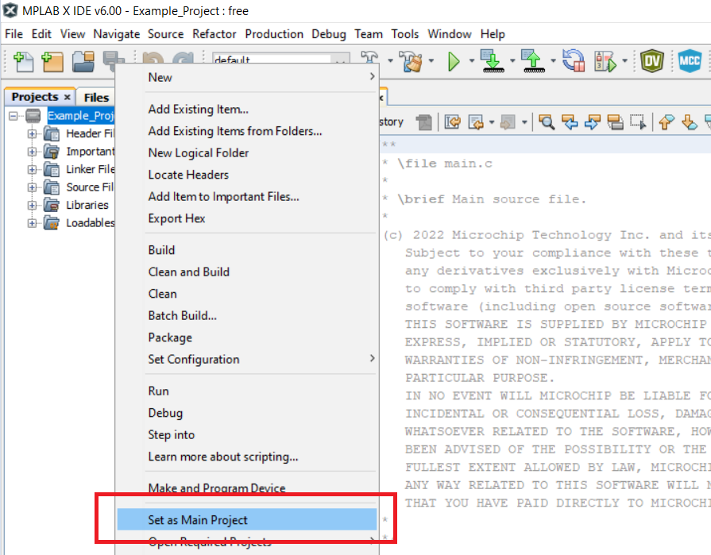

<!-- Please do not change this html logo with link -->

# Configurable Custom Logic (CCL) in Three Different Modes Using the AVR64DD32 Microcontroller

 The repository contains three MPLAB® X projects:

1.  [Logic AND Gate](#1-logic-and-gate) — This example shows how to configure the Configurable Custom Logic (CCL) peripheral to implement an AND gate with three inputs.
2.  [SR Latch](#2-sr-latch) — The CCL is used to implement a SR latch. This functionality is created by using two adjacent Look-Up Tables (LUTs) connected through a sequential logic block.
3.  [State Decoder](#3-state-decoder) — The CCL's LUT0 and LUT1 are configured to decode the presence of the `b'10110` pattern on the input pins.

## Related Documentation

More details and code examples on the AVR64DD32 can be found at the following links:

- [AVR64DD32 Product Page](https://www.microchip.com/wwwproducts/en/AVR64DD32)
- [AVR64DD32 Code Examples on GitHub](https://github.com/microchip-pic-avr-examples?q=AVR64DD32)
- [AVR64DD32 Project Examples in START](https://start.atmel.com/#examples/AVR64DD32CuriosityNano)

## Software Used

- [MPLAB® X IDE](http://www.microchip.com/mplab/mplab-x-ide) v6.00 or newer
- [MPLAB® XC8](http://www.microchip.com/mplab/compilers) v2.36 or newer
- [AVR-Dx Series Device Pack](https://packs.download.microchip.com/) v2.0.152 or newer

## Hardware Used

- The AVR64DD32 Curiosity Nano Development Board is used as a test platform.
   

## Operation

To program the Curiosity Nano (CNANO) board with this MPLAB® X project, follow the steps provided in the [How to Program the Curiosity Nano board](#how-to-program-the-curiosity-nano-board) chapter.  

## 1. Logic AND Gate

This code example shows how to configure the CCL peripheral to implement an AND gate with three inputs. The output of the LUT is routed to an external pin.

### 1.1 Setup

The following configurations must be made for this project:

System clock: 4 MHz (default)

CCL - LUT1:
-   LUT: enabled
-   LUT-IN0: IN0 selected
-   LUT-IN1: IN1 selected
-   LUT-IN2: IN2 selected
-   LUT output: enabled
-   Truth table = 0x80
-   CCL: enabled

| Pin            |  Configuration    |
| :------------: | :---------------: |
| PC0 (LUT1-IN0) |   Digital input   |
| PC1 (LUT1-IN1) |   Digital input   |
| PC2 (LUT1-IN2) |   Digital input   |
| PC3 (LUT1-OUT) |   Digital output  |

### 1.2 Demo

The table below shows the truth table for an AND gate with three inputs:

|   IN0  |   IN1  |   IN2  |   OUT  |
| :----: | :----: | :----: | :----: |
| `LOW`  | `LOW`  | `LOW`  | `LOW`  |
| `LOW`  | `LOW`  | `HIGH` | `LOW`  |
| `LOW`  | `HIGH` | `LOW`  | `LOW`  |
| `LOW`  | `HIGH` | `HIGH` | `LOW`  |
| `HIGH` | `LOW`  | `LOW`  | `LOW`  |
| `HIGH` | `LOW`  | `HIGH` | `LOW`  |
| `HIGH` | `HIGH` | `LOW`  | `LOW`  |
| `HIGH` | `HIGH` | `HIGH` | `HIGH` |

The picture below shows how the output (PC3) changes according to the gate inputs (PC0, PC1 and PC2).

 

### 1.3 Summary

This project shows how to configure the Analog-to-Digital (ADC) peripheral to execute conversions every time a certain event happens. In this example, the Real-Time Clock (RTC) overflow (at 500 ms) is used as an event generator. Every time a conversion cycle is triggered, the on-board LED is toggled to signal the end of a conversion.  
[Back to top](#configurable-custom-logic-ccl-in-three-different-modes-using-the-avr64dd32-microcontroller) 

## 2. SR Latch

In this code example, the CCL is used to implement a SR latch. This functionality is created by using two adjacent LUTs (LUT0 and LUT1 for this example) connected through a sequential logic block. For the Set and Reset signals, two GPIO pins are used as inputs for the LUTs.

### 2.1 Setup

The following configurations must be made for this project:

System clock: 4 MHz (default)

CCL:
-   CCL: enabled
-   LUT0:
    -   LUT0-IN0: Masked
    -   LUT0-IN1: IN1
    -   LUT0-IN2: Masked
    -   Truth table = 0x01
    -   Output: enabled
    -   Filter: enabled
    -   LUT0: enabled
-   LUT1:
    -   LUT1-IN0: Masked
    -   LUT1-IN1: IN1
    -   LUT1-IN2: Masked
    -   Truth table = 0x01
    -   Filter: enabled
    -   LUT1: enabled
-   Sequencer selected: RS

| Pin            |  Configuration   | SR Latch          |
| :------------: | :--------------: |:--------------:   |
| PA1 (LUT0-IN1) |   Digital input  | SET               |
| PC1 (LUT1-IN1) |   Digital input  | RESET             |
| PA3 (LUT0-OUT) |   Digital output | Output            |

(PA1) is not connected by default on the CNANO board.
The user must connect them through soldering on the back of the board where it is written PA1.

### 2.2 Demo

In this example, an active-low SR latch was implemented, having the following truth table:

| Set     | Reset   | Output            |
| :-----: | :-----: | :---------------: |
| `HIGH`  | `HIGH`  | `Hold State`      |
| `HIGH`  | `LOW`   | `Clear`           |
| `LOW`   | `HIGH`  | `Set`             |
| `LOW`   | `LOW`   | `Forbidden State` |

The picture below shows how the output of the sequencer (PA3) changes according to the active-low SR latch behaviour.

 

### 2.3 Summary

This code example shows how to configure the CCL peripheral to implement a SR latch.  
[Back to top](#configurable-custom-logic-ccl-in-three-different-modes-using-the-avr64dd32-microcontroller) 

## 3. State Decoder

In this code example, the CCL's LUT0 and LUT1 are configured to decode the presence of the `b'10110` pattern on the input pins. A circuit composed of LUT0 and LUT1 is implemented to trigger its output when the inputs are in the form of the given pattern.

### 3.1 Setup

The following configurations must be made for this project:

System clock: 4 MHz (default)

CCL:
-   CCL: enabled
-   LUT0:
    -   LUT0-IN0: IN0
    -   LUT0-IN1: IN1
    -   LUT0-IN2: LINK
    -   Truth table = 0x40
    -   Output: enabled
    -   LUT0: enabled
-   LUT1:
    -   LUT1-IN0: IN0
    -   LUT1-IN1: IN1
    -   LUT1-IN2: IN2
    -   Truth table = 0x20
    -   LUT1: enabled

| Pin            |  Configuration   |
| :------------: | :--------------: |
| PA0 (LUT0-IN0) |   Digital input  |
| PA1 (LUT0-IN1) |   Digital input  |
| PC0 (LUT1-IN0) |   Digital input  |
| PC1 (LUT1-IN1) |   Digital input  |
| PC2 (LUT1-IN2) |   Digital input  |
| PA3 (LUT0-OUT) |   Digital output |

PA0 and PA1 are not connected by default on the CNANO board.
The user must connect them through soldering on the back of the board where it is written PA0 and PA1.

### 3.2 Demo

The pattern that needs to be decoded is `b'10110`:

| Pin            | Value      |
| :------------: | :--------: |
| PC2 (LUT1_IN2) | `1` - HIGH |
| PC1 (LUT1_IN1) | `0` - LOW  |
| PC0 (LUT1_IN0) | `1` - HIGH |
| PA1 (LUT0_IN1) | `1` - HIGH |
| PA0 (LUT0_IN0) | `0` - LOW  |

The picture below shows how the output (PA3) goes high when the pattern is detected on the input pins.

 

### 3.3 Summary

This code example shows how to configure the CCL peripheral to implement a state decoder.  
[Back to top](#configurable-custom-logic-ccl-in-three-different-modes-using-the-avr64dd32-microcontroller) 

## How to Program the Curiosity Nano board

This chapter demonstrates how to use the MPLAB® X IDE to program an AVR® device with an Example_Project.X. This can be applied for any other projects.

1.  Connect the board to the PC.

2.  Open the Example_Project.X project in MPLAB® X IDE.

3.  Set the Example_Project.X project as main project.
     Right click the project in the **Projects** tab and click **Set as Main Project**.
     

4.  Clean and build the Example_Project.X project.
     Right click the **Example_Project.X** project and select **Clean and Build**.
     

5.  Select **AVRxxxxx Curiosity Nano** in the Connected Hardware Tool section of the project settings:
     Right click the project and then **Properties**.
     Click the arrow under the Connected Hardware Tool.
     Select **AVRxxxxx Curiosity Nano** (click the **SN**), click **Apply** and then **OK**:
     

6.  Program the project to the board.
     Right click the project and then **Make and Program Device**.
     

     

- [Back to 1. Logic AND Gate](#1-logic-and-gate)
- [Back to 2. SR Latch](#2-sr-latch)
- [Back to 3. State Decoder](#3-state-decoder)
- [Back to top](#configurable-custom-logic-ccl-in-three-different-modes-using-the-avr64dd32-microcontroller)
